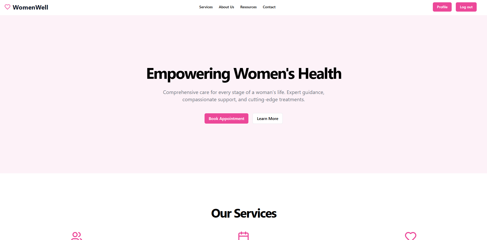
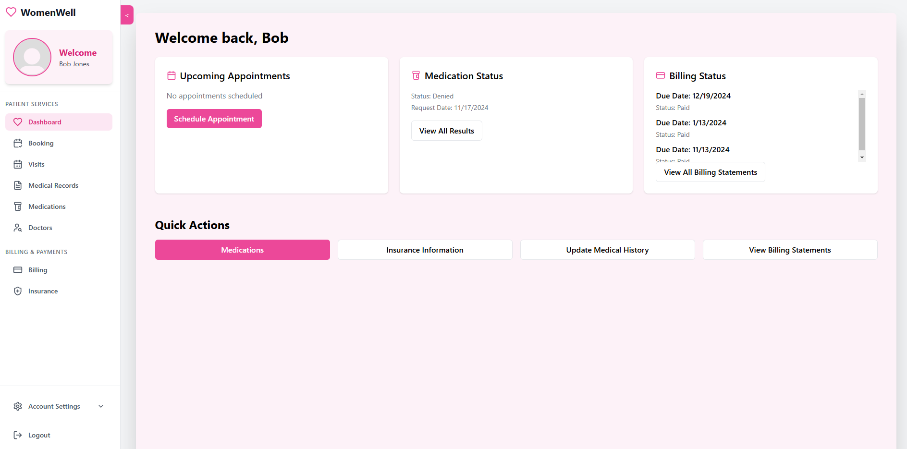
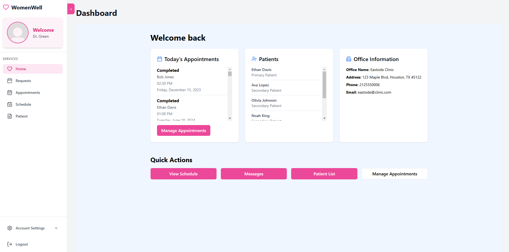
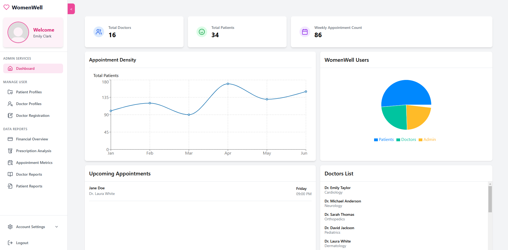

# Women's Health Medical Database 🏥

[](docs/architecture/SYSTEM_ARCHITECTURE.md)
[](/docs)
[](/docs/setup/DOCKER_SETUP.md)
[](/docs/api/API_DOCUMENTATION.md)

A comprehensive healthcare management platform connecting **doctors** and **patients** for appointment scheduling, prescription management, and billing/insurance tracking. Built with real-world medical practice requirements in mind.

[View Live Demo](https://hospital-system-production.vercel.app/) | [View Features Showcase](/docs/demo/FEATURES_SHOWCASE.md)



## ✨ Key Features

- **🔐 Role-Based Access Control**
  - Patient Portal
  - Doctor Dashboard
  - Admin Management Interface

- **📅 Appointment Management**
  - Smart Scheduling System
  - Automated Email Notifications
  - Real-time Updates

- **💊 Medical Records & Prescriptions**
  - Complete Patient History
  - E-Prescriptions
  - Refill Management

- **💳 Billing & Insurance**
  - Payment Processing
  - Insurance Verification
  - Financial Reporting

## 🏗 Architecture

Our platform uses modern web technologies for a scalable and maintainable solution:

- **Frontend**: React + Tailwind CSS
- **Backend**: Node.js + Express
- **Database**: MySQL
- **Authentication**: JWT
- **Deployment**: Vercel

[View Detailed Architecture →](/docs/architecture/SYSTEM_ARCHITECTURE.md)

## 🚀 Quick Start

### Using Docker (Recommended)
```bash
# Clone the repository
git clone https://github.com/YourUsername/Hospital_Management_App.git

# Start the application
docker-compose up
```
[Detailed Docker Setup Guide →](/docs/setup/DOCKER_SETUP.md)

### Manual Setup
```bash
# Database Setup
mysql -u root -p
CREATE DATABASE womens_health_db;
USE womens_health_db;
SOURCE SQLdump_Screenshots/Hospital_Management_App_prod_dump.sql;

# Backend Setup
cd server
npm install
npm start

# Frontend Setup
cd client
npm install
npm start
```

## 📚 Documentation

- [System Architecture](/docs/architecture/SYSTEM_ARCHITECTURE.md)
- [API Documentation](/docs/api/API_DOCUMENTATION.md)
- [Docker Setup Guide](/docs/setup/DOCKER_SETUP.md)
- [Features Showcase](/docs/demo/FEATURES_SHOWCASE.md)

## 🖥 Screenshots

### Patient Experience


### Doctor Interface


### Administrative Tools


[View More Screenshots →](/docs/demo/FEATURES_SHOWCASE.md)

## 👥 Team & Contributions

| Name | Key Contributions |
|------|------------------|
| **Eraj Anwar** | Authentication, Registration, Doctor Assignment |
| **Anthony Casarta** | Personal Info, Medical History, Insurance, Deployment |
| **Adam Johnson** | Booking, Appointment Handling, Admin Deactivation, Email Triggers |
| **Isabella Truong** | Dashboards, Sidebars, Patient Info Reports |
| **Sthiber Guevara** | Patient Pages, Doctor Schedule, Admin Financial Report |

## 🛠 Technical Highlights

- **Security First**: JWT authentication, role-based access control
- **Real-time Updates**: Instant appointment status changes
- **Email Integration**: Automated notifications system
- **Database Triggers**: Automated status updates and email queuing
- **Responsive Design**: Mobile-friendly interface with Tailwind CSS

## 📄 License

This project is licensed under the [MIT License](LICENSE).

---

> **Note:** This application was developed as part of a database systems course (COSC 3380 – Fall 2024). While it implements real-world healthcare management features, additional security and compliance measures would be needed for production use.

## 🔗 Links

- [Original Repository](https://github.com/Knathmer/Hospital_System)
- [Live Demo](https://hospital-system-production.vercel.app/)
- [Documentation](/docs)
