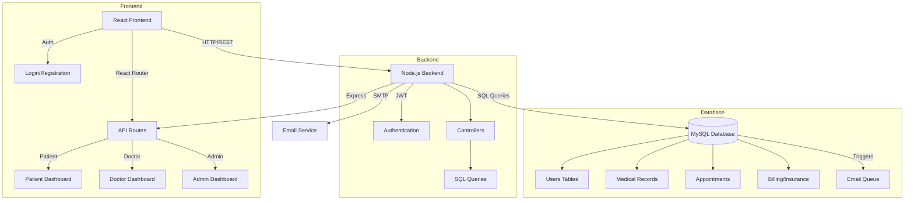

# System Architecture Overview

## High-Level Architecture

## Key Components

### 1. Frontend Architecture
- **React Components**: Modular UI components organized by user role
- **Context API**: Global state management for authentication
- **Protected Routes**: Role-based access control
- **Responsive Design**: Tailwind CSS for styling
- **Dynamic Forms**: Interactive patient and doctor interfaces

### 2. Backend Architecture
- **Express Server**: RESTful API endpoints
- **JWT Authentication**: Secure user sessions
- **Role Middleware**: Access control by user type
- **Controllers**: Business logic separation
- **Email Service**: Automated notifications

### 3. Database Design
- **User Management**: Separate tables for patients, doctors, and admins
- **Medical Records**: Patient history and prescriptions
- **Appointment System**: Scheduling and status tracking
- **Billing/Insurance**: Payment and insurance tracking
- **Database Triggers**: Automated email notifications and status updates

## Security Measures
- JWT-based authentication
- Role-based access control
- Password hashing
- Input validation
- SQL injection prevention

## Data Flow Examples

### Appointment Booking Process
1. Patient selects appointment slot
2. Frontend sends booking request
3. Backend validates availability
4. Database creates appointment record
5. Trigger queues confirmation email
6. Response returns to frontend
7. UI updates with confirmation

### Prescription Management
1. Doctor creates prescription
2. Backend validates and stores
3. Patient receives notification
4. Pharmacy gets updated
5. Billing system processes charges

## Integration Points
- Email service for notifications
- Authentication system
- Database triggers
- Frontend state management
- API endpoints

This architecture provides a scalable, maintainable, and secure foundation for the healthcare management system while maintaining clear separation of concerns.