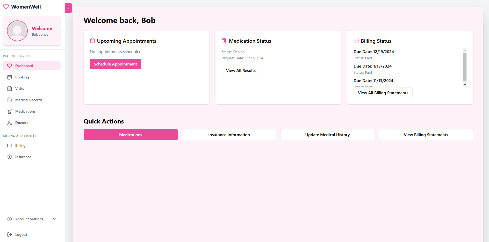
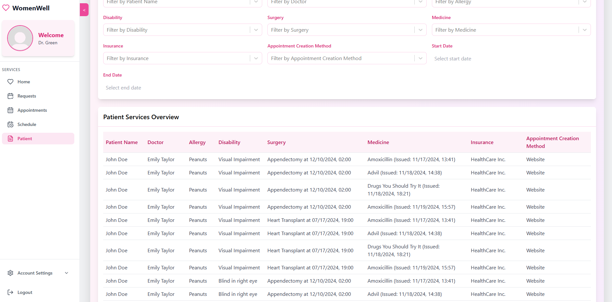

# Features Showcase

This document provides a visual walkthrough of the key features and functionalities of our Women's Health Medical Database system.

## User Interfaces

### 1. Landing Page

The landing page provides an intuitive entry point to our healthcare platform, featuring:
- Clean, professional design
- Easy access to login/registration
- Overview of available services

### 2. Authentication

Secure authentication system with:
- Role-based login (Patient/Doctor/Admin)
- New user registration
- Password security measures

## Role-Specific Features

### Patient Features

#### Dashboard Overview

Patient dashboard provides quick access to:
- Upcoming appointments
- Recent prescriptions
- Medical history
- Billing information

#### Appointment Management

Patients can:
- Schedule new appointments
- View appointment history
- Manage existing appointments
- Receive appointment notifications

#### Medical Records

Comprehensive medical record management:
- View and update medical history
- Track medications
- Access prescription history
- Request prescription refills

#### Billing Management

Easy billing management:
- View current bills
- Payment history
- Insurance information
- Payment processing

### Doctor Features

#### Doctor Dashboard

Efficient practice management:
- Daily schedule overview
- Patient appointments
- Quick access to patient records
- Prescription management

#### Patient Management

Complete patient care tools:
- Patient medical history
- Treatment records
- Prescription management
- Appointment notes

#### Appointment Management

Streamlined appointment handling:
- View daily/weekly schedule
- Manage appointment requests
- Update appointment status
- Add appointment notes

### Admin Features

#### Administrative Dashboard

Comprehensive system management:
- System overview
- User management
- Analytics dashboard
- Report generation

#### User Management

Complete user control:
- Manage doctor profiles
- Manage patient accounts
- Update user permissions
- Account activation/deactivation

#### Reports and Analytics

Detailed reporting system:
- Financial analytics
- Appointment statistics
- Prescription tracking
- System usage metrics

## Technical Implementation Highlights

- **Role-Based Access Control**: Each user type has specific permissions and features
- **Real-Time Updates**: Immediate reflection of changes across the system
- **Responsive Design**: Consistent experience across devices
- **Secure Data Handling**: Protected patient information and medical records
- **Automated Notifications**: Email alerts for appointments and prescriptions